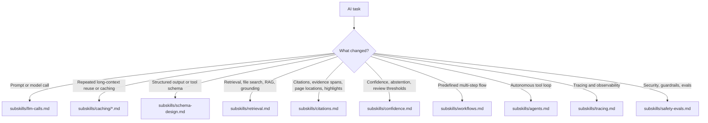

# AI Engineering

This skill is the default entrypoint for AI changes in any codebase using it. Keep it loaded for any LLM call, agent, workflow, or structured AI schema change, then read only the internal subskill file that matches the task.

## Always Apply

1. Verify current SDK and provider APIs before coding.
2. Define success before increasing complexity. Start with a minimal eval set from real tasks or failures, then optimize against that instead of intuition.
3. Prefer the simplest architecture that meets the requirement: direct LLM call, then structured workflow, then a single agent, then multi-agent only if proven necessary.
4. Make machine-consumed outputs schema-first. If downstream code branches on it, encode that branch in Zod for TypeScript or Pydantic for Python instead of prose.
5. Treat field order in structured outputs as part of the control surface. Put intermediate checks before final decisions, and final answers before meta-judgments such as confidence or review routing unless you intentionally need an earlier checkpoint.
6. Separate instructions from user input, retrieved content, and tool output. Treat all non-system text as untrusted data.
7. Version prompts, schemas, tools, and model choices together, and log enough metadata to tie behavior changes back to a trace or eval run.
8. For knowledge access, do not default to vector-database RAG. First ask whether the task is better served by long context, a search tool, hybrid retrieval, or document-scoped lookup. Read `subskills/retrieval.md`.
9. Default to the provider already established by the project. If the project is greenfield and the task does not require another provider, OpenAI is a reasonable starting default.
10. If a workflow sends many near-identical requests over the same long file or shared context, check provider-side prompt or context caching before inventing custom memoization. Start with `subskills/llm-calls.md`, then read the matching file under `subskills/caching/`.
11. If AI behavior changes, run the project's AI-focused regression tests if they exist.

## Routing

Read the matching subskill before editing:

- Direct model calls, prompt structure, streaming, provider rate limits, retries, backoff, and provider choices: `subskills/llm-calls.md`
- OpenAI prompt caching, `prompt_cache_key`, and extended retention: `subskills/caching/openai.md`
- Anthropic automatic caching, block breakpoints, and `cache_control`: `subskills/caching/anthropic.md`
- Gemini implicit caching, explicit cache objects, and TTL handling: `subskills/caching/gemini.md`
- Mistral caching limits and when to own caching yourself: `subskills/caching/mistral.md`
- Azure OpenAI prompt caching and Azure-vs-native differences: `subskills/caching/azure-openai.md`
- Azure Claude caching through Anthropic-style semantics: `subskills/caching/azure-claude.md`
- Azure-hosted Mistral and missing documented prompt caching support: `subskills/caching/azure-mistral.md`
- Zod/Pydantic Schema, tool contracts, and structured output design: `subskills/schema-design.md`
- Retrieval architecture, long-context vs RAG decisions, hybrid search, reranking, and citations: `subskills/retrieval.md`
- Citation architecture, evidence extraction, offsets, page mapping, and document geometry: `subskills/citations.md`
- Confidence design, abstention, contradiction checks, source weighting, and review routing: `subskills/confidence.md`
- Predefined prompt chains, routing, parallelization, orchestrator-workers, and evaluator-optimizer flows: `subskills/workflows.md`
- Autonomous planning, tool use, checkpoints, stop conditions, and human-in-the-loop agents: `subskills/agents.md`
- MLflow-based local tracing, searchable traces, span design, and trace retention for debugging and improvement loops: `subskills/tracing.md`
- Prompt injection defense, authorization, model tradeoffs, and regression testing: `subskills/safety-evals.md`

## Companion Skills

Load adjacent skills when your environment includes them:

- AI SDK or provider-wrapper skills for framework-specific invocation details
- UI or chat-element skills for frontend rendering of model output
- Framework-specific app skills when AI behavior is embedded in a larger web application

## File-Level Heuristics

- Prompt builders, model registries, provider clients, or raw generation calls: read `subskills/llm-calls.md`
- Repeated large-file requests, long shared prefixes, cache-control parameters, cache handles, or provider-specific cache tradeoffs: read the matching file under `subskills/caching/`
- Tool inputs and outputs, structured objects, or schema helpers: read `subskills/schema-design.md`
- Retrieval tools, knowledge bases, file search, chunking, citations, or vector stores: read `subskills/retrieval.md`
- Inline citations, evidence spans, page jumps, PDF highlights, or provenance mapping: read `subskills/citations.md`
- Confidence buckets, abstention logic, contradiction handling, or human-review routing: read `subskills/confidence.md`
- Predefined step-by-step orchestration, fixed branching, or model pipelines: read `subskills/workflows.md`
- Autonomous planning, dynamic tool choice, or stop conditions: read `subskills/agents.md`
- Trace setup, trace search, evaluation datasets from traces, or observability instrumentation: read `subskills/tracing.md`
- Prompt defense, permissions, eval harnesses, or model routing: read `subskills/safety-evals.md`
