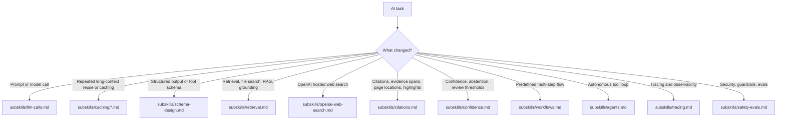

# AI Engineering

This skill is the default entrypoint for AI changes in any codebase using it. Keep it loaded for any LLM call, agent, workflow, or structured AI schema change, then read only the internal subskill file that matches the task.

## Always Apply

1. Verify current SDK and provider APIs before coding.
2. Define success before increasing complexity. Start with a minimal eval set from real tasks or failures, then optimize against that instead of intuition.
3. Prefer the simplest architecture that meets the requirement: direct LLM call, then structured workflow, then a single agent, then multi-agent only if proven necessary.
4. Make machine-consumed outputs schema-first. If downstream code branches on it, encode that branch in Zod for TypeScript or Pydantic for Python instead of prose. Field order matters.
5. Separate instructions from user input, retrieved content, and tool output. Treat all non-system text as untrusted data.
6. Version prompts, schemas, tools, and model choices together, and log enough metadata to tie behavior changes back to traces and evals.
7. For knowledge access, do not default to vector-database RAG. First ask whether the task is better served by long context, a search tool, hybrid retrieval, or document-scoped lookup.
8. Default to the provider already established by the project. If the project is greenfield and the task does not require another provider, OpenAI is a reasonable starting default.
9. If a workflow sends many near-identical requests over the same long file or shared context, check provider-side prompt or context caching before inventing custom memoization.
10. If AI behavior changes, run the project's AI-focused regression tests if they exist.

## Routing

## Choose The Matching Subskill

- `subskills/llm-calls.md`: single calls, prompt shape, retries, rate limits, model selection, and provider caching. If the issue is repeated long-context reuse, then read the matching file under `subskills/caching/`.
- `subskills/schema-design.md`: the model contract itself, including field order, enums, discriminated unions, and lean versus audit schemas.
- `subskills/retrieval.md`: how evidence is found, scoped, chunked, reranked, and passed into grounded answering.
- `subskills/openai-web-search.md`: OpenAI Responses API hosted web search, source filters, URL annotations, source lists, and structured-output citation handling.
- `subskills/citations.md`: how answers map back to exact evidence locations, pages, offsets, and highlights.
- `subskills/confidence.md`: how evidence quality, contradictions, and review thresholds map to confidence, abstention, and review routing.
- `subskills/workflows.md`: code-owned multi-step orchestration.
- `subskills/agents.md`: model-owned next-action selection inside a bounded loop.
- `subskills/tracing.md`: observability, trace search, and turning executions into eval/debug inputs.
- `subskills/safety-evals.md`: prompt-injection defense, guardrails, evals, and calibration.

Common combinations:

- grounded answering: `retrieval.md` plus `citations.md`
- grounded answering with review routing: `retrieval.md` plus `citations.md` plus `confidence.md`
- OpenAI web search with structured output: `openai-web-search.md` plus `schema-design.md` plus `citations.md`
- any structured AI output that feeds code: `schema-design.md` plus the domain subskill above it

## Companion Skills

Load adjacent skills when your environment includes them:

- AI SDK or provider-wrapper skills for framework-specific invocation details
- UI or chat-element skills for frontend rendering of model output
- Framework-specific app skills when AI behavior is embedded in a larger web application
