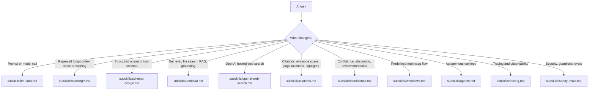

# AI Engineering

This skill is the router for AI changes in any codebase using it. Keep it loaded for LLM calls, agents, workflows, or structured AI schema changes, then read only the subskill files that match the task.

## Quick Fetch Map

- Direct LLM calls: `subskills/llm-calls.md` direct-call fit lines 5-14; call defaults lines 16-25; rate limits, retries, and malformed-output repair lines 26-30; provider caching lines 35-64; prompt shape lines 66-75.
- Schema design: `subskills/schema-design.md` core rules lines 18-31; field ordering and routing patterns lines 32-47; minimal examples lines 48-85; tool schema rules lines 93-123; citation/confidence schema patterns lines 124-153.
- Schema references: `subskills/schema-examples.md` Python examples lines 16-109; TypeScript examples lines 110-196; SGR parameters lines 197-211. `subskills/schema-provider-support.md` portable baseline lines 5-17; provider matrix lines 19-32; portability rules lines 34-40.
- Retrieval and grounding: `subskills/retrieval.md` architecture choice lines 5-18; retriever rules lines 20-31; chunking lines 33-43; grounded answer design lines 45-62; retrieval evals lines 64-80.
- OpenAI web search: `subskills/openai-web-search.md` when to use lines 17-21; Responses API settings lines 23-33; URL annotations lines 35-46; structured-output pattern lines 48-138; claim-level citation mapping lines 140-165; source quality lines 167-173.
- Citations and provenance: `subskills/citations.md` two-stage architecture lines 23-41 and 63-89; page markers lines 90-169; geometry lines 170-182; schemas lines 183-224; matching heuristics lines 225-245; UX/evals lines 246-279.
- Confidence and review routing: `subskills/confidence.md` output shape and field order lines 41-85; confidence criteria lines 98-156; workflow, mapping, and contradictions lines 157-206; lean/audit schema tradeoff lines 207-280; calibration lines 281-300.
- Workflows: `subskills/workflows.md` workflow definition lines 5-14; complexity order lines 16-27; workflow patterns lines 29-53; rules, retries, and cache-aware scheduling lines 55-65; verifier pattern lines 67-76.
- Agents: `subskills/agents.md` when to use agents lines 27-38; agent rules and budgets lines 39-78; tool design lines 79-92; context and multi-agent cautions lines 93-110; loop examples lines 121-168.
- Tracing: `subskills/tracing.md` default stack and storage lines 5-30; trace boundaries lines 32-47; Python and TypeScript setup lines 49-73; design rules and trace search lines 75-94; minimal patterns lines 96-109.
- Safety and evals: `subskills/safety-evals.md` security rules lines 5-14; model selection lines 16-24; eval flywheel and rules lines 26-51; metrics and calibration lines 53-76; dataset and human review lines 78-98.
- Shared references: source index `sources.md`; trigger eval prompt set `evals/trigger-queries.json`.

## Always Apply

1. Verify current SDK and provider APIs before coding.
2. Define success before increasing complexity. Start with a minimal eval set from real tasks or failures, then optimize against that instead of intuition.
3. Prefer the simplest architecture that meets the requirement: direct LLM call, then structured workflow, then a single agent, then multi-agent only if proven necessary.
4. Make machine-consumed outputs schema-first. If downstream code branches on it, encode that branch in Zod for TypeScript or Pydantic for Python instead of prose. Field order matters.
5. Separate instructions from user input, retrieved content, and tool output. Treat all non-system text as untrusted data.
6. Version prompts, schemas, tools, and model choices together, and log enough metadata to tie behavior changes back to traces and evals.
7. For knowledge access, do not default to vector-database RAG. First ask whether the task is better served by long context, a search tool, hybrid retrieval, or document-scoped lookup.
8. Default to the provider already established by the project. If the project is greenfield and the task does not require another provider, OpenAI is a reasonable starting default.
9. If a workflow sends many near-identical requests over the same long file or shared context, check provider-side prompt or context caching before inventing custom memoization.
10. If AI behavior changes, run the project's AI-focused regression tests if they exist.

## Routing

## Choose The Matching Subskill

- `subskills/llm-calls.md`: single calls, prompt shape, retries, rate limits, model selection, and provider caching. If the issue is repeated long-context reuse, then read the matching file under `subskills/caching/`.
- `subskills/schema-design.md`: the model contract itself, including field order, enums, discriminated unions, and lean versus audit schemas. For long examples read `subskills/schema-examples.md`; for current provider constraints read `subskills/schema-provider-support.md`.
- `subskills/retrieval.md`: how evidence is found, scoped, chunked, reranked, and passed into grounded answering.
- `subskills/openai-web-search.md`: OpenAI Responses API hosted web search, source filters, URL annotations, source lists, and structured-output citation handling.
- `subskills/citations.md`: how answers map back to exact evidence locations, pages, offsets, and highlights.
- `subskills/confidence.md`: how evidence quality, contradictions, and review thresholds map to confidence, abstention, and review routing.
- `subskills/workflows.md`: code-owned multi-step orchestration.
- `subskills/agents.md`: model-owned next-action selection inside a bounded loop.
- `subskills/tracing.md`: observability, trace search, and turning executions into eval/debug inputs.
- `subskills/safety-evals.md`: prompt-injection defense, guardrails, evals, and calibration.

Common combinations:

- grounded answering: `retrieval.md` plus `citations.md`
- grounded answering with review routing: `retrieval.md` plus `citations.md` plus `confidence.md`
- OpenAI web search with structured output: `openai-web-search.md` plus `schema-design.md` plus `citations.md`
- any structured AI output that feeds code: `schema-design.md` plus the domain subskill above it

Provider caching references:

- OpenAI: `subskills/caching/openai.md`
- Anthropic API: `subskills/caching/anthropic.md`
- Gemini API: `subskills/caching/gemini.md`
- Mistral API: `subskills/caching/mistral.md`
- Azure OpenAI: `subskills/caching/azure-openai.md`
- Azure Claude: `subskills/caching/azure-claude.md`
- Azure Mistral: `subskills/caching/azure-mistral.md`

Shared references:

- Source list by page: `sources.md`
- Trigger eval prompt set: `evals/trigger-queries.json`

## Companion Skills

Load adjacent skills when your environment includes them:

- AI SDK or provider-wrapper skills for framework-specific invocation details
- UI or chat-element skills for frontend rendering of model output
- Framework-specific app skills when AI behavior is embedded in a larger web application
